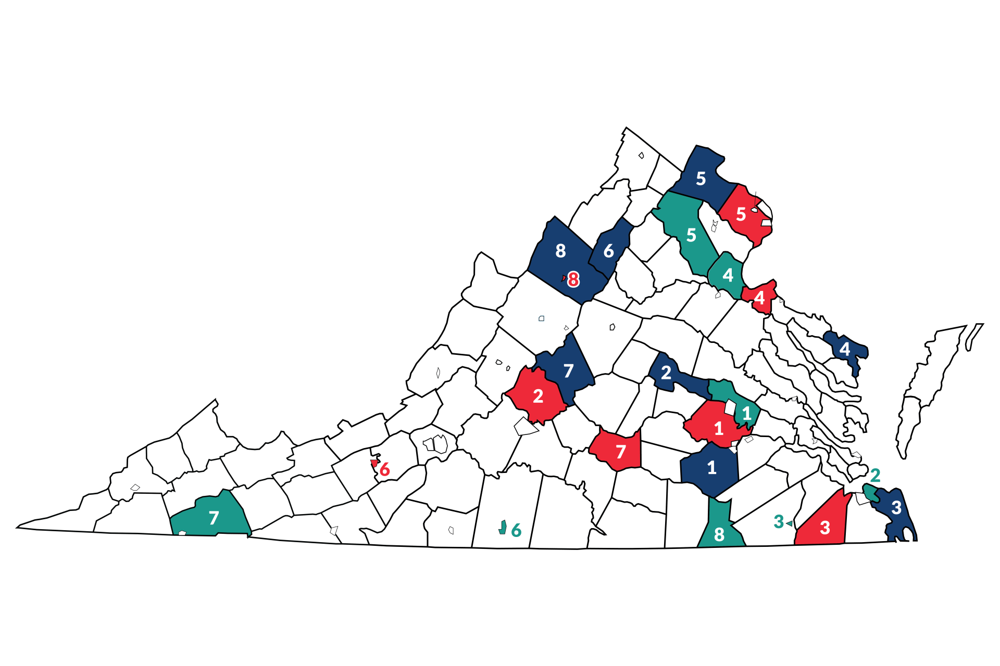

# Capstone Proposal
## Smart School Food Service Analytics: AI-Driven Demand Forecasting and Waste Reduction using Fairfax County Public Schools Data
### Proposed by: Dr. Amir Jafari
#### Email: ajafari@gwu.edu
#### Advisor: Amir Jafari
#### The George Washington University, Washington DC  
#### Data Science Program

## 1 Objective:  
 
            This project aims to develop and validate an intelligent school food service analytics system using comprehensive data
             from Fairfax County Public Schools (FCPS) that combines Point-of-Sale (POS) data with Production Records to create 
             advanced forecasting and optimization models. The research focuses on developing novel machine learning algorithms that:
             

            1. **Predict daily food demand accurately** using historical POS data, student demographics, seasonal patterns,and external factors (weather, events, holidays)
            2. **Optimize food production quantities** to minimize waste while ensuring adequate food availability across different meal programs (breakfast, lunch)
            3. **Classify student food preferences and dietary patterns** using clustering and classification techniques on selection data
            4. **Forecast leftover quantities** for different food categories (proteins, vegetables, grains) to improve procurement planning
            5. **Develop nutritional optimization models** that balance caloric requirements, nutritional guidelines, and student preferences
            6. **Create cost-effectiveness analysis** frameworks that optimize budget allocation across different meal programs and schools
            7. **Build early warning systems** for potential food shortages or excessive waste based on predictive analytics

            The research contributes novel time-series forecasting algorithms specifically designed for institutional food service
             operations and provides practical optimization frameworks that can significantly reduce food waste, improve nutritional 
             outcomes, and optimize operational costs. This work targets publication in top-tier venues such as Operations Research 
             journals, Food Policy, Applied Economics, or specialized food service management journals.
            

*Figure 1: Caption*

## 2 Dataset:  

            The project leverages comprehensive, real-world school food service data from Fairfax County Public Schools with multiple
             interconnected data sources:

            **Primary FCPS Datasets (Available in GitHub Repository:
             https://github.com/amir-jafari/Public_Research/tree/main/Fairfax_County):**

            1. **Point-of-Sale (POS) Data** (~100,000 records for breakfast and lunch):
               - Student meal selections with timestamps and meal types
               - Cashier recording system with simplified item coding (e.g., single button for pizza)
               - Daily transaction records across multiple schools and meal periods
               - Student demographic linkage for preference analysis
               - Cash register system data with meal component selections

            2. **Production Record Data** (Daily production and leftover tracking):
               - Kitchen preparation quantities for each food item and meal component
               - Leftover quantities by food category (proteins like chicken, carbohydrates like nachos, vegetables like carrots and broccoli)
               - Production planning data showing planned vs. actual preparation amounts
               - Food waste measurements and disposal tracking
               - Recipe scaling information and portion size data

            3. **Menu Planning Data**:
               - Cyclical menu patterns and seasonal variations
               - Nutritional content analysis for each meal component
               - Cost per serving and ingredient pricing information
               - Federal nutrition program compliance data (calories, nutrients, food groups)

            4. **School-Level Demographic Data**:
               - Student enrollment numbers and demographic breakdown
               - Free and reduced lunch eligibility percentages
               - School-specific attendance patterns and seasonal variations
               - Geographic and socioeconomic indicators

            **Supplementary Datasets for Model Enhancement:**

            5. **External Factor Data**:
               - Weather data (temperature, precipitation) for demand pattern analysis
               - School calendar information (holidays, events, testing periods)
               - Local food pricing and commodity cost fluctuations

            6. **Benchmark Datasets from Literature**:
               - Institutional food service forecasting datasets for model comparison
               - USDA school meal program data for national benchmarking
               - Food waste reduction case studies from other school districts

            **Data Processing and Integration Framework:**
            - PDF report parsing and database format integration
            - Multi-level data aggregation (meal level, school level, district level)
            - Time-series data preparation with multiple temporal granularities (daily, weekly, seasonal)
            - Missing data imputation and data quality assessment protocols
            

## 3 Rationale:  

            School food service operations face significant challenges in balancing nutritional requirements, cost control, and waste 
            reduction. The USDA estimates that school districts waste approximately 530,000 tons of food annually, representing
             $1.2 billion in economic losses. Current school food service management relies heavily on manual forecasting 
             and experience-based decision making, leading to several critical research gaps:

            **Research Gap 1: Limited Predictive Analytics in School Food Service**
            Existing school food service systems lack sophisticated demand forecasting capabilities that integrate multiple data 
            sources (POS, production, demographics, external factors). Most districts rely on basic historical averages without
             considering complex seasonal patterns, student preferences, or external influences.

            **Research Gap 2: Insufficient Integration of POS and Production Data**
            Current research rarely combines real-time student selection data (POS) with kitchen production records to create 
            comprehensive optimization models. This integration is crucial for understanding the complete food service pipeline 
            from preparation to consumption.

            **Research Gap 3: Lack of Multi-Objective Optimization for School Meals**
            Existing approaches focus on single objectives (cost or waste reduction) without considering the complex trade-offs
             between nutritional requirements, student satisfaction, operational costs, and regulatory compliance.

            **Research Gap 4: Limited Application of Advanced ML Techniques in Food Service**
            While machine learning has been applied to commercial food service forecasting, there's insufficient research on
             specialized algorithms for institutional settings with unique constraints (federal nutrition standards, 
             budget limitations, educational schedules).

            **Research Gap 5: Absence of Real-Time Decision Support Systems**
            Current food service management lacks intelligent systems that can provide real-time recommendations for production 
            adjustments, menu modifications, or resource allocation based on dynamic conditions.

            This research addresses these gaps by developing novel machine learning algorithms specifically designed for school 
            food service optimization, contributing to both operations research and food systems management. The work has strong 
            potential for high-impact publication in multiple domains:

            **Target Publication Venues:**
            - **Operations Research** (Impact Factor: 2.7) - Leading venue for optimization and forecasting research
            - **Food Policy** (Impact Factor: 6.1) - Premier journal for food systems research
            - **International Journal of Production Economics** (Impact Factor: 11.2) - Top operations management venue
            - **Applied Economics** (Impact Factor: 2.4) - Economics applications in food systems
            - **Journal of Foodservice Management & Education** - Specialized venue for food service research
            - **Computers & Operations Research** (Impact Factor: 4.6) - Computational approaches to operations
            

## 4 Approach:  

            **Research Methodology**: Mixed-methods approach combining advanced machine learning model development, optimization
             algorithms, and comprehensive empirical validation using real-world school food service data

            **Phase 1: Data Integration and Exploratory Analysis (Weeks 1-2)**
            - Comprehensive data preprocessing and integration of POS, production, and demographic datasets
            - Exploratory data analysis to identify patterns, seasonality, and anomalies in food demand and waste
            - Development of data quality assessment protocols and missing data imputation strategies
            - Creation of standardized data integration pipeline for multi-source school food service data

            **Phase 2: Advanced Forecasting Model Development (Weeks 3-8)**
            - **Demand Forecasting Models** (Weeks 3-4):
              * Time-series forecasting using LSTM, ARIMA, and Prophet models for daily meal demand prediction
              * Integration of external factors (weather, events, demographics) using multivariate regression and ensemble methods
              * Development of hierarchical forecasting models for different aggregation levels (meal, school, district)
              * Student preference classification using clustering algorithms (K-means, hierarchical clustering) on POS data

            - **Production Optimization Algorithms** (Weeks 5-6):
              * Multi-objective optimization models balancing waste reduction, cost minimization, and nutritional requirements
              * Leftover prediction models using regression trees and neural networks based on production-consumption patterns
              * Recipe scaling optimization using linear programming and constraint satisfaction techniques
              * Dynamic menu planning algorithms that adapt to seasonal availability and student preferences

            - **Cost-Effectiveness Analysis Framework** (Weeks 7-8):
              * Economic modeling of food service operations using cost-benefit analysis and ROI calculations
              * Budget allocation optimization across different meal programs and nutritional components
              * Procurement planning models that minimize costs while meeting nutritional and quality standards
              * Scenario analysis for different operational strategies and policy changes

            **Phase 3: Integrated Decision Support System Development (Weeks 9-11)**
            - Development of comprehensive analytics dashboard integrating all developed models
            - Real-time alert system for potential shortages, overproduction, or budget overruns
            - Interactive visualization tools for food service managers and administrators
            - Integration of nutritional compliance monitoring with USDA meal pattern requirements
            - Mobile-friendly interface for kitchen staff and food service directors

            **Phase 4: Model Validation and Performance Evaluation (Weeks 12-14)**
            - Comprehensive evaluation using historical FCPS data with train-validation-test splits
            - Cross-validation across different schools and time periods to ensure model generalizability
            - Performance comparison with existing forecasting methods and industry benchmarks
            - Statistical analysis of improvement in waste reduction, cost savings, and nutritional outcomes
            - Sensitivity analysis and robustness testing under different operational scenarios

            **Phase 5: Research Publication and System Documentation (Weeks 15-16)**
            - Preparation of research manuscript for submission to target journal (Operations Research, Food Policy, or IJPE)
            - Development of comprehensive technical documentation and implementation guides
            - Creation of policy recommendations for school district food service management
            - Preparation of presentation materials for academic conferences and industry forums
            - Development of open-source toolkit for other school districts to implement similar systems
            

## 5 Timeline:  

            **Week 1**: Data integration, preprocessing, and comprehensive exploratory data analysis of FCPS datasets
            **Week 2**: Data quality assessment, missing data imputation, and baseline forecasting model establishment
            **Weeks 3-4**: Time-series demand forecasting model development (LSTM, ARIMA, Prophet) and external factor integration
            **Weeks 5-6**: Production optimization algorithms and leftover prediction model development
            **Weeks 7-8**: Cost-effectiveness analysis framework and budget allocation optimization models
            **Week 9**: Integrated decision support system architecture design and dashboard development
            **Week 10**: Real-time alert system implementation and nutritional compliance monitoring integration
            **Week 11**: User interface development and mobile-friendly system optimization
            **Week 12**: Comprehensive model validation using historical data and cross-validation across schools
            **Week 13**: Performance evaluation, comparison with existing methods, and statistical significance testing
            **Week 14**: Sensitivity analysis, robustness testing, and scenario analysis for different operational conditions
            **Week 15**: Research manuscript preparation and submission to target publication venue
            **Week 16**: Technical documentation, policy recommendations, and open-source toolkit development
            

## 6 Expected Number Students:  

            This project is designed for **1 student** with strong technical background in:
            - **Machine Learning and Time-Series Analysis** (required): Experience with forecasting models, optimization algorithms, and statistical analysis
            - **Data Science and Analytics** (required): Python/R programming, data preprocessing, visualization, and statistical modeling
            - **Operations Research or Economics** (preferred): Understanding of optimization, cost-benefit analysis, and operational efficiency metrics
            - **Database Management** (required): Experience with data integration, SQL, and handling large datasets

            The focused scope on school food service analytics ensures the single student can make substantial individual
             contributions suitable for first-author publication in a high-impact operations research or food policy journal. 
             The project combines real-world data with advanced analytics techniques, providing clear individual research
              contributions.
            

## 7 Possible Issues:  

            **Technical Challenges and Mitigation Strategies:**

            **Challenge 1: Data Quality and Completeness**
            - Risk: FCPS datasets may have missing values, inconsistent recording practices, or data quality issues
            - Mitigation: Implement robust data preprocessing pipelines, develop multiple imputation strategies, collaborate with FCPS 
            staff for data validation, and create data quality assessment protocols

            **Challenge 2: Model Complexity and Interpretability**
            - Risk: Advanced ML models may be too complex for practical implementation by food service staff
            - Mitigation: Develop interpretable model variants, create user-friendly interfaces, provide comprehensive training
             materials, and implement model explanation techniques (SHAP, LIME)

            **Challenge 3: Seasonal and Event-Based Variability**
            - Risk: School food service has complex seasonal patterns and irregular events that may be difficult to model
            - Mitigation: Incorporate comprehensive calendar data, develop event-based adjustments, use ensemble methods for robustness,
             and implement adaptive learning algorithms

            **Challenge 4: Multi-School Generalization**
            - Risk: Models trained on specific schools may not generalize to other schools with different demographics or operational 
            patterns
            - Mitigation: Develop hierarchical models that account for school-specific factors, implement transfer learning techniques,
             and validate across diverse school contexts within FCPS

            **Challenge 5: Real-Time Implementation Challenges**
            - Risk: Operational deployment may face technical challenges with real-time data integration and system performance
            - Mitigation: Design scalable architecture, implement efficient algorithms, develop offline backup systems, and create
             comprehensive testing protocols

            **Challenge 6: Regulatory and Nutritional Compliance**
            - Risk: Optimization models may conflict with federal nutrition requirements or food safety regulations
            - Mitigation: Embed regulatory constraints directly into optimization models, collaborate with nutrition experts,
             implement compliance monitoring, and develop fallback strategies

            **Data and Privacy Considerations:**

            **Challenge 7: Student Privacy and Data Security**
            - Risk: Student-level data requires careful privacy protection and secure handling
            - Mitigation: Implement data anonymization techniques, follow FERPA guidelines, use aggregated data where possible,
             and develop secure data handling protocols

            **Challenge 8: Institutional Collaboration and Access**
            - Risk: Ongoing data access and collaboration with FCPS may face administrative or policy challenges
            - Mitigation: Establish formal data sharing agreements, maintain regular communication with school district partners,
             and develop sustainable collaboration frameworks

            **Project Management and Timeline Risks:**

            **Risk: Scope Expansion and Feature Creep**
            - Mitigation: Maintain clear project boundaries, prioritize core contributions, implement agile development practices,
             and prepare incremental publication strategy

            **Risk: Technical Implementation Complexity**
            - Mitigation: Start with simpler baseline models, implement iterative development cycles, maintain regular advisor 
            consultations, and prepare backup approaches for complex components

            **Risk: Data Processing and Analysis Time**
            - Mitigation: Develop automated preprocessing pipelines, utilize cloud computing resources, implement parallel processing 
            approaches, and prepare contingency plans for computational bottlenecks

            **Publication Strategy Risks:**

            **Risk: Competitive Research Environment**
            - Mitigation: Focus on unique FCPS dataset advantages, target multiple venue options, prepare workshop papers for 
            early visibility, and maintain active research community engagement

            **Risk: Interdisciplinary Review Challenges**
            - Mitigation: Clearly position work within target venue contexts, collaborate with domain experts, prepare comprehensive
             literature reviews, and ensure methodological rigor across disciplines
            

## Contact
- Author: Amir Jafari
- Email: [ajafari@gwu.edu](mailto:ajafari@gwu.edu)
- GitHub: [https://github.com/amir-jafari/Capstone](https://github.com/https://github.com/amir-jafari/Capstone)
