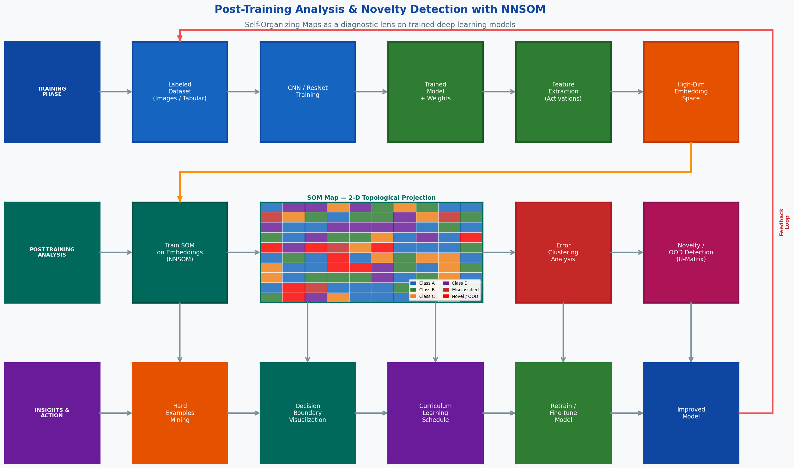

# Capstone Proposal
## Post-Training Analysis and Novelty Detection Using Neural Network Self-Organizing Maps (NNSOM)
### Proposed by: Dr. Amir Jafari
#### Email: ajafari@gwu.edu
#### Advisor: Amir Jafari
#### The George Washington University, Washington DC  
#### Data Science Program

## 1 Objective:  

            The goal of this project is to use Self-Organizing Maps (SOM) as a post-training diagnostic and
            interpretability tool for deep learning models. After a convolutional neural network (CNN) or any
            other supervised model is trained on a labeled dataset, students will apply the NNSOM library
            (https://amir-jafari.github.io/SOM/) to cluster the model's internal feature representations and
            raw input data in order to answer a fundamental question: what kinds of mistakes does the model make,
            and why?

            Key Objectives:
            1. Train a baseline deep learning model (e.g., CNN on MNIST, CIFAR-10, or a domain-specific dataset)
               and establish standard performance benchmarks (accuracy, precision, recall, F1).
            2. Extract intermediate feature representations (activations) from the trained model for every
               sample in the training, validation, and test sets.
            3. Train a Self-Organizing Map on the extracted embeddings using the NNSOM library, producing a
               2-dimensional topological map of the high-dimensional feature space.
            4. Analyze the SOM map to identify: class cluster structure, overlap regions (sources of
               misclassification), hard examples (samples near cluster boundaries), and systematic error patterns.
            5. Implement novelty detection: use SOM quantization error and U-Matrix distances to flag
               out-of-distribution (OOD) or anomalous samples that the model has never seen patterns of during training.
            6. Use the SOM-derived insights to guide targeted retraining strategies, such as hard-example mining,
               data augmentation for underrepresented cluster regions, and curriculum learning schedules.
            7. Produce a reusable analysis pipeline that can be applied to any dataset/model combination,
               packaged as open-source code with tutorials.
            

*Figure 1: Caption*

## 2 Dataset:  

            All datasets listed below are publicly available with no access restrictions:

            PRIMARY DATASETS (choose one as the main experimental setting):

            1. MNIST (Handwritten Digits):
               - 70,000 grayscale 28x28 images, 10 classes
               - Download: torchvision.datasets.MNIST or tensorflow.keras.datasets.mnist
               - Ideal for initial prototyping and validating the SOM pipeline

            2. Fashion-MNIST:
               - 70,000 grayscale 28x28 images, 10 fashion categories
               - Download: torchvision.datasets.FashionMNIST
               - Slightly harder than MNIST; good for studying inter-class confusion

            3. CIFAR-10 / CIFAR-100:
               - 60,000 color 32x32 images, 10 or 100 classes
               - Download: torchvision.datasets.CIFAR10 / CIFAR100
               - Tests whether the SOM approach scales to richer visual features

            4. Domain-Specific (optional, chosen by students):
               - Medical imaging: NIH Chest X-Ray (https://nihcc.app.box.com/v/ChestXray-NIHCC)
               - Remote sensing: EuroSAT (https://github.com/phelber/EuroSAT)
               - Audio: UrbanSound8K (https://urbansounddataset.weebly.com/)
               Students may substitute their own labeled dataset of interest.

            DATASET PREPARATION:
            - Split: 70% train / 15% validation / 15% test (stratified)
            - Normalize pixel values to [0, 1] or use ImageNet statistics for pretrained backbones
            - Record class distribution; note any imbalance for later SOM cluster analysis
            

## 3 Rationale:  

            Deep learning models achieve impressive accuracy on benchmarks, yet practitioners frequently
            encounter surprising failures in deployment. Understanding why a model fails is as important
            as maximizing its average accuracy. Current interpretability tools (saliency maps, SHAP, LIME)
            operate at the individual-sample level; they tell you which pixels mattered for one prediction
            but do not reveal systematic, population-level error patterns.

            Self-Organizing Maps offer a complementary, global view. By projecting high-dimensional feature
            representations onto a 2-D topology-preserving grid, SOM reveals the geometric structure of
            what the model has learned:
            - Cluster quality: Are class representations tight and well-separated, or do they bleed together?
            - Error geography: Where on the map do misclassified samples land? Are errors concentrated in
              specific cluster regions, indicating a structural weakness?
            - Hard examples: Samples near cluster boundaries are inherently ambiguous; identifying them
              enables targeted data collection or augmentation.
            - Novelty detection: Samples far from any learned prototype (high quantization error) are likely
              OOD or anomalous — a capability critical for safe deployment in high-stakes domains.

            The NNSOM library (https://amir-jafari.github.io/SOM/) provides a well-structured, extensible
            Python implementation supporting both CPU (NumPy) and GPU (CuPy) backends, with built-in
            quality metrics (quantization error, topological error, distortion) and rich visualization
            utilities — making it an ideal research platform for this capstone.

            WHY THIS PROJECT IS TIMELY:
            - Explainable AI (XAI) is an active research area with high demand from industry and regulators.
            - SOM-based post-hoc analysis is underexplored relative to gradient-based methods, offering
              genuine novelty opportunities for publication.
            - The NNSOM library is an in-house GWU research artifact; student contributions can directly
              extend and validate it, with potential co-authorship on follow-up papers.
            

## 4 Approach:  

            PHASE 1: MODEL TRAINING BASELINE (Weeks 1-2)

            [Week 1: Environment Setup & Data Pipeline]
            - Set up Python environment: PyTorch (or TensorFlow), NNSOM, matplotlib, scikit-learn
            - Download and preprocess chosen dataset; visualize class distributions
            - Define evaluation metrics: accuracy, per-class F1, confusion matrix
            - Implement data loaders with augmentation (random crop, horizontal flip for CIFAR)

            [Week 2: Train Baseline CNN]
            - Implement a standard CNN architecture (LeNet-5 for MNIST; ResNet-18 for CIFAR-10)
            - Train to convergence; record train/val/test metrics
            - Identify the feature extraction layer (e.g., penultimate fully connected layer)
            - Extract and save feature embeddings for all splits as NumPy arrays

            PHASE 2: SOM TRAINING & VISUALIZATION (Weeks 3-5)

            [Week 3: SOM Setup with NNSOM]
            - Install and explore NNSOM library (pip install nnsom)
            - Configure SOM hyperparameters: grid size (e.g., 10x10 or 15x15), learning rate, sigma,
              number of epochs
            - Train SOM on train-set embeddings; monitor quantization error across epochs
            - Visualize trained SOM: component planes, hit histogram, U-Matrix

            [Week 4: Cluster Analysis]
            - Assign each sample (train + test) to its Best Matching Unit (BMU) on the SOM
            - Color-code the SOM grid by true class label; identify class cluster regions
            - Compute cluster purity and class-cluster intersection metrics (available in NNSOM)
            - Plot confusion heatmaps overlaid on the SOM to show where class confusion occurs

            [Week 5: Error Pattern Analysis]
            - Separate correctly classified vs. misclassified samples on the SOM map
            - Identify "error hotspots": SOM regions with disproportionately high misclassification rates
            - Retrieve and visualize the actual images/samples in error hotspot regions
            - Hypothesize why these samples are hard: inter-class similarity, noise, rare subtype, etc.

            PHASE 3: NOVELTY DETECTION (Weeks 6-8)

            [Week 6: Novelty Detection via Quantization Error]
            - For each test sample, compute its distance to the BMU (quantization error)
            - Fit a threshold on the training-set quantization error distribution (e.g., 95th percentile)
            - Flag test samples exceeding the threshold as "novel" or OOD
            - Evaluate: introduce known OOD data (e.g., SVHN samples when model trained on MNIST) and
              measure detection rate

            [Week 7: U-Matrix & Topological Analysis]
            - Compute U-Matrix (unified distance matrix) from trained SOM weights
            - High U-Matrix values indicate cluster boundaries; very high values in a BMU region
              signal that the sample is far from any learned prototype
            - Compare U-Matrix-based novelty scoring against quantization-error-based scoring
            - Visualize novelty scores overlaid on the SOM grid

            [Week 8: Comparative Evaluation]
            - Benchmark SOM novelty detection against classical baselines:
              * Isolation Forest (scikit-learn)
              * One-Class SVM
              * Autoencoder reconstruction error
            - Metrics: AUROC, AUPR, FPR at 95% TPR
            - Analyze failure modes: which novel samples does SOM miss, and why?

            PHASE 4: GUIDED RETRAINING (Weeks 9-11)

            [Week 9: Hard Example Mining]
            - Use SOM cluster-boundary samples and error hotspot samples as a hard-example pool
            - Design a curriculum: train the model first on easy samples (cluster centers), then
              progressively introduce hard boundary samples
            - Compare curriculum-trained model accuracy vs. standard training baseline

            [Week 10: Targeted Data Augmentation]
            - For SOM regions with high error rates, apply aggressive augmentation to samples in those regions
            - Re-train the model with augmented hard examples; measure improvement in error hotspot regions
            - Evaluate whether fixing cluster-level errors degrades performance elsewhere (trade-off analysis)

            [Week 11: Iterative SOM Re-analysis]
            - Re-extract features from the retrained model; re-train SOM on new embeddings
            - Compare old vs. new SOM maps: did cluster boundaries sharpen? Did error hotspots shrink?
            - Document the feedback loop: SOM analysis → targeted retraining → improved SOM structure

            PHASE 5: PAPER WRITING & CODE RELEASE (Weeks 12-14)

            [Week 12: Results Consolidation & Visualizations]
            - Produce all final figures: SOM maps, error hotspot overlays, novelty score distributions,
              curriculum learning curves, before/after retraining comparisons
            - Write results tables: baseline accuracy, post-retraining accuracy, novelty detection AUROC

            [Week 13: Research Paper Draft]
            Paper structure (6-8 pages, AAAI / ICLR workshop format):
            1. Abstract: Problem, SOM-based approach, key results
            2. Introduction: Motivation for post-training SOM analysis
            3. Related Work: XAI methods, OOD detection, SOM in deep learning
            4. Methodology: Pipeline — train CNN, extract features, train SOM, analyze clusters, detect novelty
            5. Experiments: Datasets, baselines, metrics, ablation (grid size, feature layer choice)
            6. Results: Tables + SOM visualizations
            7. Discussion & Conclusion: What did SOM reveal that standard metrics did not?

            [Week 14: Code Release & Documentation]
            - GitHub repository with: training scripts, SOM analysis notebooks, novelty detection module
            - README with installation instructions and step-by-step tutorial
            - Jupyter notebooks: one per phase (training, SOM analysis, novelty detection, retraining)
            - Requirements.txt with pinned dependencies
            

## 5 Timeline:  

            Week 1:    Environment setup, dataset download, data pipeline, CNN architecture selection
            Week 2:    Train baseline CNN; extract and save feature embeddings for all data splits
            Week 3:    Install NNSOM, configure SOM hyperparameters, train SOM, initial visualizations
            Week 4:    Cluster analysis — class coloring, cluster purity, confusion overlay on SOM map
            Week 5:    Error pattern analysis — identify error hotspots, retrieve and inspect hard samples
            Week 6:    Novelty detection via quantization error; introduce OOD test data and evaluate
            Week 7:    U-Matrix analysis; topological novelty scoring; compare to quantization-error approach
            Week 8:    Benchmark novelty detection vs. Isolation Forest, One-Class SVM, Autoencoder
            Week 9:    Hard example mining; design and run curriculum learning experiment
            Week 10:   Targeted data augmentation for error hotspot regions; retrain and evaluate
            Week 11:   Iterative SOM re-analysis on retrained model; document feedback loop
            Week 12:   Consolidate all results, produce final figures and tables
            Week 13:   Write research paper draft (AAAI / ICLR workshop format)
            Week 14:   Code release, GitHub documentation, final presentation

            TOTAL: 14 weeks (one semester)

            KEY MILESTONES:
            - Week 2:  Trained baseline model + saved embeddings
            - Week 4:  Working SOM map with class cluster visualization
            - Week 6:  Novelty detection pipeline functional
            - Week 8:  Comparative novelty detection benchmark complete
            - Week 10: Retrained model with targeted augmentation evaluated
            - Week 12: All results and figures finalized
            - Week 14: Paper submitted to workshop; code released on GitHub

            DELIVERABLES BY WEEK 14:
            - Trained baseline CNN (MNIST or CIFAR-10)
            - SOM-based post-training analysis pipeline (reusable across datasets/models)
            - Novelty detection module with quantization-error and U-Matrix scoring
            - Curriculum learning and targeted augmentation experiments
            - Research paper draft (6-8 pages)
            - GitHub repository with notebooks, scripts, and documentation
            

## 6 Expected Number Students:  

            RECOMMENDED: 2-3 students

            ROLE DISTRIBUTION FOR 2 STUDENTS:

            Student 1: Model Training & Feature Engineering
            - Responsibilities: Implement and train the CNN baseline; handle data pipelines and preprocessing;
              extract and manage feature embeddings; run retraining experiments (curriculum learning,
              targeted augmentation)
            - Skills: PyTorch or TensorFlow, CNN architectures, data augmentation

            Student 2: SOM Analysis & Novelty Detection
            - Responsibilities: Set up and train SOM using the NNSOM library; implement cluster analysis,
              error hotspot identification, and novelty detection (quantization error, U-Matrix);
              benchmark against classical OOD detection baselines; produce all visualizations
            - Skills: NNSOM, scikit-learn, matplotlib, unsupervised learning

            SHARED RESPONSIBILITIES (both students):
            - Paper writing, code documentation, final presentation
            - Weekly integration of feature extraction output (Student 1) into SOM pipeline (Student 2)

            FOR 3 STUDENTS (optional third role):
            Student 3: Evaluation, Benchmarking & Writing
            - Responsibilities: Design evaluation protocols, run ablation studies (SOM grid size, feature
              layer, dataset choice), write the research paper, manage GitHub repository
            

## 7 Possible Issues:  

            TECHNICAL CHALLENGES AND SOLUTIONS:

            1. SOM Grid Size Selection:
            - ISSUE: Too small a grid loses resolution; too large leads to sparse maps with many empty neurons
            - SOLUTION: Start with a heuristic (side length ≈ 5 * sqrt(N_samples)); use quantization error
              and topological error curves to tune; NNSOM provides both metrics

            2. High-Dimensional Embeddings:
            - ISSUE: SOM training time scales quadratically with embedding dimension
            - SOLUTION: Apply PCA to reduce embeddings to 50-100 dimensions before SOM training;
              verify that PCA does not discard discriminative information (check variance explained)

            3. Novelty Threshold Calibration:
            - ISSUE: Choosing the quantization error threshold for OOD detection requires a held-out
              in-distribution validation set with no OOD contamination
            - SOLUTION: Use the training set quantization error distribution; set threshold at 95th or
              99th percentile; report AUROC over a range of thresholds

            4. Class Imbalance in Error Hotspots:
            - ISSUE: Rare classes may have few SOM hits, making hotspot statistics unreliable
            - SOLUTION: Report per-class metrics separately; weight SOM analysis by class frequency;
              oversample rare classes during SOM training if needed

            5. GPU / CuPy Setup:
            - ISSUE: NNSOM's GPU backend requires CuPy, which depends on the CUDA version
            - SOLUTION: Prototype on CPU with NumPy backend; switch to GPU for large-scale experiments;
              document exact CUDA + CuPy version requirements in README

            6. Retraining Instability:
            - ISSUE: Curriculum learning and targeted augmentation can destabilize training if
              the hard-example ratio is too high too early
            - SOLUTION: Use a gradual pacing function (start at 10% hard examples, increase by 10%
              every 5 epochs); monitor validation accuracy throughout

            RISK MITIGATION TIMELINE:
            - Weeks 1-2:  Validate that baseline CNN trains correctly; confirm embedding extraction works
            - Weeks 3-4:  Validate SOM convergence (quantization error decreasing); check cluster coherence
            - Weeks 5-6:  Confirm OOD samples are correctly introduced and flagged in novelty detection
            - Weeks 7-8:  Verify baseline comparisons use identical train/test splits and thresholds
            - Weeks 9-10: Monitor retrained model for catastrophic forgetting on easy examples
            - Weeks 11-12: Cross-check all figures and numbers between students before paper writing
            - Weeks 13-14: Allow 3 days for code review and README verification before GitHub release
            

## Contact
- Author: Amir Jafari
- Email: [ajafari@gwu.edu](mailto:ajafari@gwu.edu)
- GitHub: [https://github.com/amir-jafari/SOM](https://github.com/https://github.com/amir-jafari/SOM)
