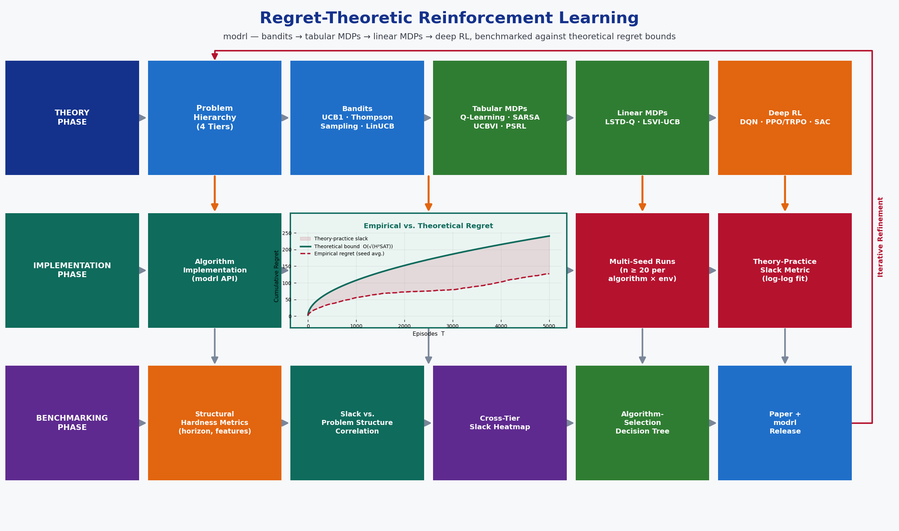

# Capstone Proposal
## Regret-Theoretic Reinforcement Learning: Convergence Analysis and Empirical Benchmarking of Bandit, Tabular, Linear, and Deep RL Algorithms
### Proposed by: Dr. Amir Jafari
#### Email: ajafari@gwu.edu
#### Advisor: Amir Jafari
#### The George Washington University, Washington DC  
#### Data Science Program

## 1 Objective:  

            The goal of this project is to conduct a mathematically rigorous, reproducible study that
            connects theoretical regret and convergence guarantees in reinforcement learning (RL) to their
            empirical behavior, across four levels of problem structure: stochastic and contextual bandits,
            tabular finite-horizon MDPs, linear (function-approximation) MDPs, and deep RL with nonlinear
            function approximation. The project is built around the in-house GWU RL library modrl
            (https://github.com/twallett/modrl), a modular Bandit / Classical / Deep RL Python library
            currently under active development, and contributes new benchmarking and diagnostic modules
            back to it.

            Key Objectives:
            1. Derive (or restate with full proof sketches) the theoretical regret / convergence guarantees
               for a representative algorithm at each level of the RL hierarchy: UCB1 and Thompson Sampling
               for K-armed bandits (gap-dependent O(log T) regret), LinUCB / OFUL for contextual linear
               bandits (O(d sqrt(T) log T) regret), Q-learning convergence via Robbins–Monro stochastic
               approximation, UCBVI and Posterior Sampling RL (PSRL) for tabular episodic MDPs
               (O(sqrt(H^2 S A T)) regret), LSVI-UCB for linear MDPs (O(sqrt(d^3 H^3 T)) regret), and the
               policy gradient theorem / natural policy gradient / trust-region monotonic-improvement bound
               underlying REINFORCE, TRPO, and PPO.
            2. Implement each algorithm inside modrl with a common, seed-controlled experiment interface,
               and empirically measure cumulative regret (or sample complexity to epsilon-optimality) across
               a minimum of 20 random seeds per algorithm-environment pair.
            3. Build a "regret-vs-theory" benchmarking framework that overlays the empirical regret curve
               against the theoretical bound (normalized / constant-fit via log-log least squares) for every
               algorithm-environment pair, producing a quantitative theory-practice slack metric.
            4. Identify structural predictors of that slack — effective horizon 1/(1-gamma), minimum state
               reachability, feature coherence / eluder-dimension proxy, reward sparsity, and entropy of the
               optimal policy — and document practical algorithm-selection guidelines analogous to a
               "which RL algorithm for which problem structure" decision tree.
            5. Package the full pipeline — theory notes, algorithm implementations, and the regret-vs-theory
               benchmarking framework — as a reusable open-source extension of modrl, with Jupyter notebooks
               and automated benchmark reports.
            

*Figure 1: Caption*

## 2 Dataset:  

            All environments and datasets below are publicly available with no access restrictions.
            The project organizes environments into four tiers of increasing problem structure, mirroring
            the algorithm hierarchy studied in the Approach section.

            TIER 0 — STOCHASTIC & CONTEXTUAL BANDITS:
            1. Synthetic K-armed Bernoulli / Gaussian bandits (K = 5, 10, 20, 50) with controlled reward
               gaps Delta, for verifying gap-dependent O(log T) regret scaling
            2. Yahoo! Front Page Today Module (R6A/R6B) click-log dataset — public contextual bandit
               benchmark: https://webscope.sandbox.yahoo.com/catalog.php?datatype=r
            3. MovieLens-25M, replayed as a contextual bandit (arms = movies, context = user features):
               https://grouplens.org/datasets/movielens/25m/

            TIER 1 — TABULAR FINITE-HORIZON / DISCOUNTED MDPs:
            4. FrozenLake-v1, CliffWalking-v0, Taxi-v3 (Gymnasium built-in, discrete state/action)
            5. RiverSwim — classic hard-exploration benchmark (sparse reward, chain MDP)
            6. DeepSea and other exploration-scaling environments from bsuite:
               https://github.com/google-deepmind/bsuite (Osband et al., 2019)

            TIER 2 — LINEAR MDPs / LINEAR FUNCTION APPROXIMATION:
            7. Synthetic Linear MDP construction (combination-lock feature maps, per Yang & Wang, 2019),
               with known feature dimension d and controllable misspecification
            8. MountainCar-v0 and Acrobot-v1 (Gymnasium) with tile-coding / RBF feature maps

            TIER 3 — DEEP RL (NONLINEAR FUNCTION APPROXIMATION):
            9. Gymnasium Classic Control + Box2D: CartPole-v1, Acrobot-v1, Pendulum-v1,
               MountainCarContinuous-v0, LunarLander-v2, LunarLanderContinuous-v2
               Download: https://gymnasium.farama.org/
            10. MinAtar — lightweight 10x10 Atari-style suite (Breakout, Asterix, Freeway, Seaquest,
                SpaceInvaders), chosen so full multi-seed sweeps are feasible without GPU clusters:
                https://github.com/kenjyoung/MinAtar
            11. bsuite full battery (memory, credit assignment, scale, noise experiments) for
                cross-checking algorithm implementations against DeepMind's published reference scores

            DATASET / ENVIRONMENT PREPARATION:
            - Standardize every environment behind a common modrl Gymnasium-style API (reset/step/seed)
            - Record for each environment: state/action cardinality (or dimension d), effective horizon,
              reward sparsity, and (where known) the theoretical regret bound and its constants
            - Run >= 20 seeds per algorithm-environment pair; log per-episode return and cumulative regret
            - Document all preprocessing (feature construction, discretization, reward scaling) in a
              reproducible notebook per tier
            

## 3 Rationale:  

            Reinforcement learning theory has produced precise, provable regret and convergence guarantees
            for many algorithm families:
            - Bandit algorithms (UCB1, Thompson Sampling, LinUCB) have tight, well-understood regret bounds
              that are routinely verified in isolation on toy problems.
            - Tabular RL algorithms (Q-learning, UCBVI, PSRL) have convergence proofs and near-minimax
              regret bounds under the finite-MDP assumption.
            - Linear and deep function-approximation methods (LSVI-UCB, DQN, TRPO, PPO, SAC) have
              theoretical guarantees that are far more fragile in practice, since the "deadly triad"
              (bootstrapping + off-policy learning + function approximation) can break convergence.

            Yet there is no single, reproducible benchmark that:
            (a) implements a representative algorithm at every level of this hierarchy inside one common
                framework and experiment protocol,
            (b) directly overlays measured empirical regret against the theoretical bound for each
                algorithm-environment pair, rather than reporting theory and practice in separate papers, and
            (c) systematically explains WHEN and WHY the empirical-to-theoretical slack grows, using
                measurable structural properties of the environment (effective horizon, feature coherence,
                reward sparsity).

            This project fills that gap using the in-house GWU library modrl (modular Bandit / Classical /
            Deep RL library, developed with Tyler Wallett), which is explicitly designed to host bandit,
            tabular, and deep RL algorithms side by side under one API — making it the natural home for a
            cross-hierarchy regret-theoretic benchmark.

            WHY THIS PROJECT IS TIMELY AND PUBLISHABLE:
            - The "theory-practice gap" in RL is an actively discussed open problem; DeepMind's bsuite
              (Osband et al., ICLR 2019) established the template of scoring RL algorithms against
              theoretically motivated diagnostics, and is itself a highly cited benchmark paper.
            - Reproducibility and benchmark papers are now a first-class contribution type, with a
              dedicated NeurIPS Datasets & Benchmarks track and a dedicated Reinforcement Learning
              Conference (RLC) / Reinforcement Learning Journal (RLJ) since 2024.
            - modrl is an in-house GWU artifact under active development; students contribute production
              modules to it and can co-author the resulting paper together with the library's maintainer.
            - The resulting "algorithm-selection by problem structure" guideline is directly useful to
              practitioners deciding between tabular, linear, and deep RL methods under a compute budget.
            

## 4 Approach:  

            PHASE 1: FOUNDATIONS & BANDIT THEORY (Weeks 1-3)

            [Week 1: Setup & Mathematical Foundations]
            - Install modrl, Gymnasium, bsuite, MinAtar; run provided tutorials end-to-end
            - Formalize the finite-horizon MDP (S, A, P, r, H, gamma); derive the Bellman expectation and
              Bellman optimality equations; define regret R(T) = sum_t [V*(s_t) - V^{pi_t}(s_t)]
            - Set up project structure: theory/, bandits/, tabular/, linear/, deep/, benchmarks/, notebooks/
            - Create an algorithm_registry.csv cataloguing: algorithm, problem tier, theoretical bound,
              reference paper, implementation status

            [Week 2: Multi-Armed Bandits]
            - Implement epsilon-greedy, UCB1, and Thompson Sampling for K-armed Bernoulli/Gaussian bandits
            - Derive the gap-dependent UCB1 regret bound O(sum_a log T / Delta_a) (Auer et al., 2002) and
              the Bayesian regret bound for Thompson Sampling (Agrawal & Goyal, 2012)
            - Verify empirically: plot cumulative regret vs. log T on synthetic bandits across arm counts

            [Week 3: Contextual & Linear Bandits]
            - Implement LinUCB / OFUL for contextual linear bandits; derive the O(d sqrt(T) log T) regret
              bound (Abbasi-Yadkori et al., 2011) via the self-normalized martingale confidence ellipsoid
            - Benchmark on Yahoo! R6A/R6B click logs and a MovieLens-25M contextual-bandit replay
            - Produce the first regret-vs-theory overlay plots (Tier 0 baseline for the framework)

            PHASE 2: TABULAR MDP THEORY (Weeks 4-5)

            [Week 4: Q-Learning & SARSA]
            - Implement tabular Q-learning and SARSA; state and verify the Robbins-Monro conditions for
              stochastic approximation (sum alpha_t = infinity, sum alpha_t^2 < infinity) that guarantee
              almost-sure convergence to Q* (Watkins & Dayan, 1992; Jaakkola et al., 1994)
            - Benchmark on FrozenLake-v1, CliffWalking-v0, Taxi-v3

            [Week 5: Optimism & Posterior Sampling]
            - Implement UCBVI (optimistic value iteration with Bernstein-style bonus) and Posterior
              Sampling RL (PSRL); derive/restate the near-minimax regret bound O(sqrt(H^2 S A T))
              (Azar, Osband & Munos, 2017) and the Bayesian regret bound for PSRL (Osband & Van Roy, 2017)
            - Benchmark on RiverSwim and the DeepSea family in bsuite (hard-exploration diagnostics)

            PHASE 3: LINEAR FUNCTION APPROXIMATION (Weeks 6-7)

            [Week 6: Linear MDPs & LSVI-UCB]
            - Construct synthetic linear MDPs (combination-lock features, known d) and tile-coded /
              RBF feature maps for MountainCar-v0 and Acrobot-v1
            - Implement LSVI-UCB; derive the O(sqrt(d^3 H^3 T)) regret bound under the linear MDP
              assumption (Jin, Yang, Wang & Jordan, COLT 2020)

            [Week 7: Approximation Error & Misspecification]
            - Implement LSTD-Q and Linear SARSA as lower-theory baselines
            - Derive/apply the value approximation error propagation bound
              ||V - V*||_infty <= 2 gamma / (1-gamma)^2 * approx_error (Munos, 2005; Bertsekas & Tsitsiklis)
            - Empirically measure value error vs. feature dimension and controlled misspecification

            PHASE 4: DEEP RL — VALUE-BASED METHODS (Weeks 8-9)

            [Week 8: DQN Family]
            - Implement DQN with experience replay and target networks (Mnih et al., 2015); implement
              Double DQN and derive the overestimation-bias correction E[max Q] >= max E[Q]
              (van Hasselt, Guez & Silver, 2016); implement Dueling DQN (value/advantage decomposition)
            - Benchmark on Classic Control (CartPole, Acrobot) and a 3-5 game MinAtar subset

            [Week 9: Policy Gradient Foundations]
            - Derive the policy gradient theorem grad J(theta) = E[grad log pi_theta(a|s) Q^pi(s,a)]
              (Sutton et al., 1999); implement REINFORCE with a value baseline for variance reduction
            - State the O(1/sqrt(T)) convergence rate to a stationary point for non-convex policy
              optimization under SGD; verify empirically via gradient-norm decay curves

            PHASE 5: DEEP RL — TRUST-REGION & ACTOR-CRITIC METHODS (Weeks 10-11)

            [Week 10: Natural Gradient, TRPO, PPO]
            - Implement Natural Policy Gradient using the Fisher information matrix F(theta)
              (Kakade, 2002); implement TRPO and restate the monotonic-improvement surrogate bound
              J(pi') >= J(pi) + E[A^pi] - C * max_s KL(pi'||pi) (Schulman et al., 2015)
            - Implement PPO's clipped surrogate objective L^CLIP(theta) and compare sample efficiency
              against TRPO and vanilla policy gradient

            [Week 11: Actor-Critic & Continuous Control]
            - Implement A2C, DDPG/TD3 (deterministic policy gradient), and SAC; derive the maximum-entropy
              objective J(pi) = E[sum r_t + alpha H(pi(.|s_t))] and the soft Bellman equation (Haarnoja
              et al., 2018)
            - Benchmark on Pendulum-v1, MountainCarContinuous-v0, LunarLanderContinuous-v2

            PHASE 6: REGRET-VS-THEORY BENCHMARKING (Weeks 12-13)

            [Week 12: Full-Suite Multi-Seed Runs]
            - Run every algorithm on every assigned environment for >= 20 seeds under a fixed compute
              and hyperparameter-sweep budget (documented per algorithm)
            - Log cumulative regret / return / sample-complexity-to-epsilon for every run into a
              structured benchmarking DataFrame

            [Week 13: Theory-Practice Gap Analysis]
            - For each algorithm-environment pair, fit the theoretical bound's multiplicative constant via
              log-log least squares against the empirical regret curve; report the residual slack
            - Correlate slack with structural hardness metrics: effective horizon 1/(1-gamma), minimum
              state-reachability probability, feature coherence / eluder-dimension proxy, reward sparsity
            - Produce heatmaps: environments (rows) x algorithms (cols) x theory-practice slack (color)

            PHASE 7: GUIDELINES, PAPER, AND CODE RELEASE (Weeks 14-16)

            [Week 14: Practical Guidelines & Visualization]
            - Write an algorithm-selection decision tree/heatmap keyed on problem-structure tier
              (state/action size, feature dimension, stochasticity, compute budget)
            - Produce all final figures: regret-vs-theory overlays, slack heatmaps, sample-efficiency plots

            [Week 15: Research Paper Draft]
            Paper structure (8-10 pages, RLC / RLJ / NeurIPS Datasets & Benchmarks format):
            1. Abstract: motivation, modrl library, benchmark scope, key findings
            2. Introduction: the RL theory-practice gap and why no unified benchmark exists
            3. Background: regret/convergence definitions per algorithm tier
            4. The modrl Benchmark: environments, algorithms, experiment protocol
            5. Results: regret-vs-theory overlays, slack heatmaps, per-tier leaderboards
            6. Structural Predictors of the Theory-Practice Gap
            7. Practical Guidelines: algorithm-selection decision tree
            8. Conclusion & Future Work: extension to offline RL and safe/constrained RL

            [Week 16: Code Release & Documentation]
            - Contribute benchmarks/ and diagnostics/ modules to the modrl GitHub repository
            - Automated benchmarking script: run_benchmark.py --tier all --algo all --seeds 20
            - Jupyter notebooks: one per tier and one summary regret-vs-theory notebook
            - README with quickstart, environment setup, and reproduction commands
            - Requirements.txt with pinned dependencies; final presentation
            

## 5 Timeline:  

            Week 1:    Setup, MDP/Bellman formalism, regret definition, algorithm_registry.csv
            Week 2:    UCB1 / Thompson Sampling on K-armed bandits; O(log T) regret verification
            Week 3:    LinUCB / OFUL on contextual bandits (Yahoo R6, MovieLens); first regret-vs-theory plots
            Week 4:    Tabular Q-learning / SARSA; Robbins-Monro convergence check on FrozenLake/Taxi
            Week 5:    UCBVI / PSRL on RiverSwim and bsuite DeepSea; O(sqrt(H^2 S A T)) verification
            Week 6:    Linear MDPs and LSVI-UCB; O(sqrt(d^3 H^3 T)) regret verification
            Week 7:    LSTD-Q / Linear SARSA; approximation-error propagation bound measured empirically
            Week 8:    DQN / Double DQN / Dueling DQN on Classic Control + MinAtar subset
            Week 9:    Policy gradient theorem, REINFORCE with baseline; convergence-rate verification
            Week 10:   Natural Policy Gradient, TRPO, PPO; monotonic-improvement and clipped-objective checks
            Week 11:   A2C / DDPG / TD3 / SAC on continuous control tasks
            Week 12:   Full-suite multi-seed runs (>= 20 seeds) across all four tiers
            Week 13:   Theory-practice gap analysis; slack heatmaps; structural-predictor correlations
            Week 14:   Algorithm-selection decision tree; all final figures and slack heatmaps
            Week 15:   Research paper draft (RLC / RLJ / NeurIPS Datasets & Benchmarks format)
            Week 16:   modrl contribution, code release, README, Jupyter notebooks, final presentation

            TOTAL: 16 weeks (one semester)

            KEY MILESTONES:
            - Week 3:  Tier 0 (bandit) regret-vs-theory framework working end-to-end
            - Week 5:  Tier 1 (tabular MDP) algorithms implemented and verified
            - Week 7:  Tier 2 (linear function approximation) algorithms implemented and verified
            - Week 11: Tier 3 (deep RL) algorithms implemented and verified
            - Week 13: All theory-practice gap results in structured benchmarking DataFrame
            - Week 14: All figures and tables finalized
            - Week 16: Paper submitted; code released to the modrl GitHub repository

            DELIVERABLES BY WEEK 16:
            - Regret-vs-theory benchmarking framework spanning bandits, tabular, linear, and deep RL
            - Reference implementations of 15+ algorithms with documented theoretical guarantees
            - Structural-predictor analysis explaining when/why theory and practice diverge
            - Algorithm-selection decision tree based on problem structure
            - Research paper draft (8-10 pages)
            - New benchmarking/diagnostic modules contributed to the modrl GitHub repository
            

## 6 Expected Number Students:  

            RECOMMENDED: 2-3 students

            ROLE DISTRIBUTION FOR 2 STUDENTS:

            Student 1: Bandits & Tabular RL Theory (Tiers 0-1)
            - Responsibilities: UCB1/Thompson Sampling/LinUCB implementation and regret derivations,
              Q-learning/SARSA convergence verification, UCBVI/PSRL implementation, RiverSwim/bsuite
              hard-exploration benchmarking, algorithm_registry.csv maintenance
            - Skills: probability/statistics, martingale concentration inequalities, Python, modrl

            Student 2: Function Approximation & Deep RL (Tiers 2-3)
            - Responsibilities: Linear MDP construction and LSVI-UCB implementation, DQN family,
              policy-gradient/TRPO/PPO/SAC implementation, continuous-control benchmarking,
              approximation-error measurement
            - Skills: PyTorch, convex/non-convex optimization, deep RL, modrl

            SHARED RESPONSIBILITIES (both students):
            - Theory-practice gap analysis, paper writing, decision-tree guidelines, code documentation,
              final presentation
            - Weekly integration meetings: theoretical bounds (both students) feed the shared regret-vs-
              theory benchmarking framework

            FOR 3 STUDENTS (optional third role):
            Student 3: Benchmarking Infrastructure, Visualization & modrl Integration
            - Responsibilities: Build the multi-seed experiment runner and structured benchmarking
              DataFrame, produce all publication-quality figures (regret overlays, slack heatmaps),
              own the modrl contribution (module structure, tests, documentation), coordinate with
              Tyler Wallett on integration into the library's main branch
            

## 7 Possible Issues:  

            TECHNICAL CHALLENGES AND SOLUTIONS:

            1. Compute Cost of Multi-Seed Deep RL Sweeps:
            - ISSUE: >= 20 seeds x 10+ algorithms x multiple environments is time-intensive for deep RL
            - SOLUTION: Restrict deep-RL experiments to Classic Control + MinAtar (GPU-light); reserve
              full Atari/MuJoCo as an optional stretch goal; use GWU HPC (Colonial One) for parallel runs

            2. Seed Variance & Statistical Validity:
            - ISSUE: RL training is highly seed-sensitive; a handful of seeds can misrepresent an
              algorithm's true regret behavior
            - SOLUTION: Use >= 20 seeds per algorithm-environment pair; report bootstrapped confidence
              intervals (per bsuite / rliable conventions), not single-seed curves

            3. The Deadly Triad (Instability in Function Approximation):
            - ISSUE: Off-policy learning + bootstrapping + function approximation (DQN, linear TD) can
              diverge rather than converge
            - SOLUTION: Use target networks, experience replay, and gradient clipping to stabilize;
              document any observed divergence as a finding rather than treating it as a bug

            4. Linear MDP Assumption Violated by Real Environments:
            - ISSUE: The theoretical LSVI-UCB guarantee requires the linear MDP assumption, which does
              not hold exactly for MountainCar/Acrobot feature maps
            - SOLUTION: Validate LSVI-UCB primarily on synthetic linear MDPs that satisfy the assumption
              by construction; treat Gymnasium tile-coded results as a "near-linear" robustness check

            5. Hyperparameter Sensitivity Confounding Algorithm Comparison:
            - ISSUE: Deep RL results are notoriously sensitive to learning rate, network width, and reward
              scaling, which can make comparisons unfair
            - SOLUTION: Fix a standardized hyperparameter-sweep budget per algorithm (documented in
              algorithm_registry.csv); report best-of-sweep and median-of-sweep results separately

            6. Fitting Theoretical Constants to Empirical Regret:
            - ISSUE: Published regret bounds hide problem-dependent constants (e.g., S, A, H, d), making
              a direct numeric comparison to empirical regret non-trivial
            - SOLUTION: Fit the bound's leading constant via log-log least squares against the empirical
              curve; report the residual slack rather than a raw pass/fail against the bound

            7. bsuite / MinAtar / modrl Version Drift:
            - ISSUE: bsuite, MinAtar, and modrl are all actively maintained; API changes could break
              reproducibility mid-semester
            - SOLUTION: Pin all dependency versions in requirements.txt from Week 1; vendor a frozen
              copy of modrl's public API surface used by the project

            RISK MITIGATION TIMELINE:
            - Weeks 1-3:  Verify bandit regret pipeline matches known UCB1/Thompson Sampling curves
            - Weeks 4-5:  Confirm Q-learning/UCBVI convergence on toy MDPs with known optimal policies
            - Weeks 6-7:  Spot-check LSVI-UCB on a synthetic linear MDP with a hand-computed optimal value
            - Weeks 8-11: Cross-check DQN/PPO/SAC results against Stable-Baselines3 reference runs
            - Weeks 12-13: Have both students independently verify theory-practice slack numbers
            - Weeks 14-16: 3-day code freeze for README and notebook review before modrl merge
            

## Contact
- Author: Amir Jafari
- Email: [ajafari@gwu.edu](mailto:ajafari@gwu.edu)
- GitHub: 
